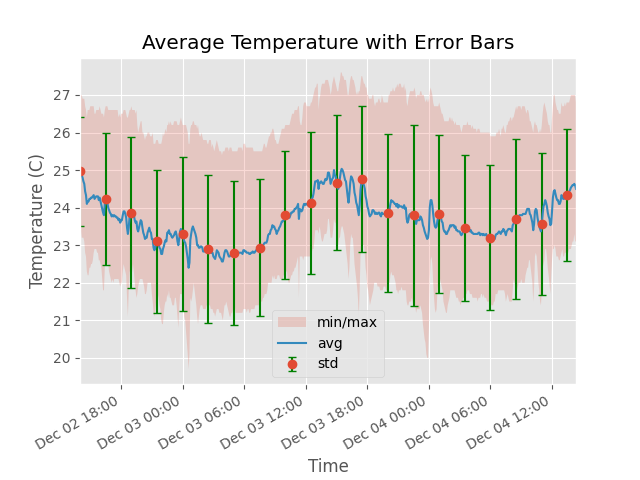
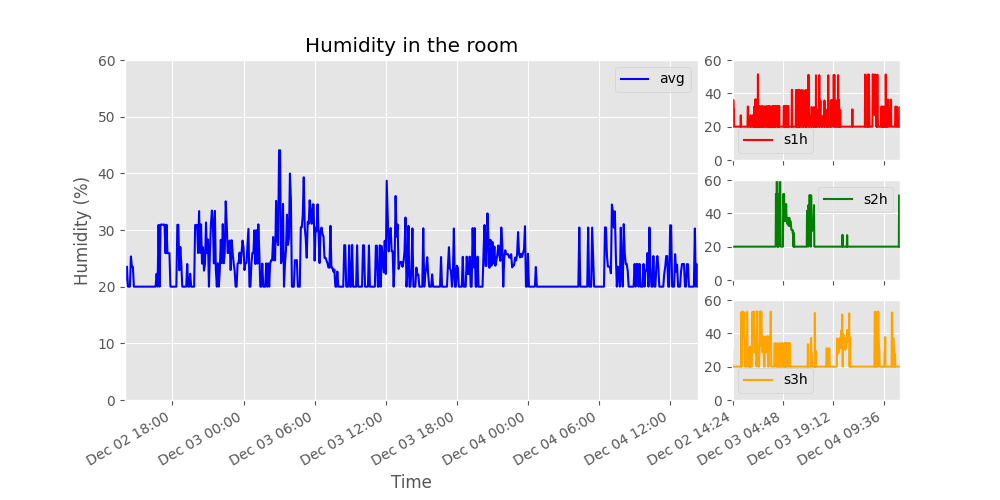
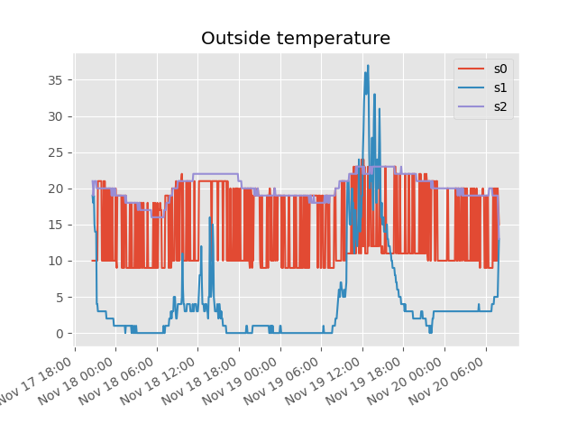
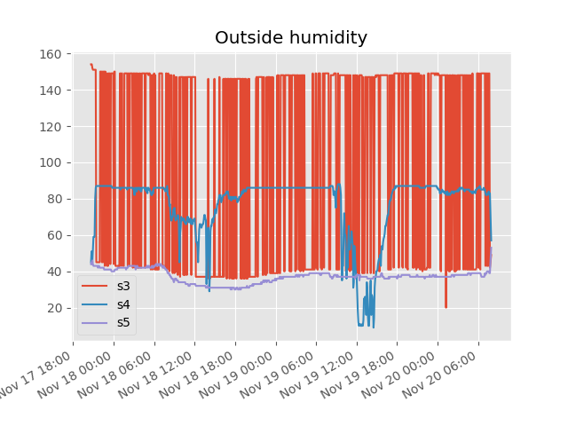

# A Distributed Weather Station for ISAK


**Fig.1:** *Weather GIF* [^1]


[^1]: Giphy, McLovin. “Search All the Gifs &amp; Make Your Own Animated Gif.” GIPHY, 2013, giphy.com/trending-gifs. Accessed 30 Nov. 2023. 


# Criteria A: Planning


## Problem Definition
Victor & Jenda are buying an apartment in Japan, but they are worried about the humidity and temperate inside the apartment. 
Now the inquiry is even bigger because winter is coming, therefore, they want to keep the humidity and temperature
stable between 20-22 degrees Celsius and 30%-50% of humidity in the apartment. They started to measure this values, but they notice it takes too much time. For this reason,
they want to get a device and a costume data script that is low-cost, and it can measure the humidity and temperature in 
the apartment in an efficient way, where the data collected is tidy, and it's easy to get a clear idea of what the apartment need.
Moreover, if possible they are asking for a pre-visualization of temperature and humidity for the next 12 hours, so they
can set up possible actions beforehand to keep this values in the best way possible.

## Proposed Solution
Considering the client requirements, an adequate solution includes a low-cost sensing device for humidity and temperature 
and a custom data script that process and analysis the samples acquired. For a low cost sensing device an adequate 
alternative is the DHT11 sensor[^2] which is offered online for less than 5 USD and provides adequate precision and range
for the client requirements (Temperature Range: 0°C to 50°C, Humidity Range: 20% to 90%). Similar devices such as the 
DHT22, AHT20 or the AM2301B [^3] have higher specifications, however the DHT11 uses a simple serial communication (SPI) 
rather than more elaborated protocols such as the I2C used by the alternatives. For the range, precision and accuracy 
required in this application the DHT11 provides the best compromise. Connecting the DHT11 sensor to a computer requires 
a device that provides a Serial Port communication. An economical and often used alternative for prototyping is the Arduino 
UNO microcontroller [^4]. "Arduino is an open-source electronics platform based on easy-to-use hardware and software"[^5]. 
In addition to the low cost of the Arduino (< 6USD), this device is programmable and expandable[^2]. Other alternatives 
include different versions of the original Arduino but their size and price make them a less adequate solution.

Considering the budgetary constraints of the client and the hardware requirements, the software tool that I proposed for 
this solution is Python. Python's open-source nature and platform independence contribute to the long-term viability of 
the system. The use of Python simplifies potential future enhancements or modifications, allowing for seamless scalability 
without the need for extensive redevelopment [^6][^7]. In comparison to the alternative C or C++, which share similar 
features, Python is a High level programming language (HL) with high abstraction [^8]. For example, memory management 
is automatic in Python whereas it is responsibility of the C/C++ developer to allocate and free up memory [^8], this 
could result in faster applications but also memory problems. In addition, a HLL language will allow me and future 
developers extend the solution or solve issues promptly.


[^2]: Industries, Adafruit. “DHT11 Basic Temperature-Humidity Sensor + Extras.” Adafruit Industries Blog RSS, https://www.adafruit.com/product/386. 


[^3]: Nelson, Carter. “Modern Replacements for DHT11 and dht22 Sensors.” Adafruit Learning System, https://learn.adafruit.com/modern-replacements-for-dht11-dht22-sensors/what-are-better-alternatives.  


[^4]:“How to Connect dht11 Sensor with Arduino Uno.” Arduino Project Hub, https://create.arduino.cc/projecthub/pibots555/how-to-connect-dht11-sensor-with-arduino-uno-f4d239.  


[^5]:Team, The Arduino. “What Is Arduino?: Arduino Documentation.” Arduino Documentation | Arduino Documentation, https://docs.arduino.cc/learn/starting-guide/whats-arduino.  


[^6]:Tino. “Tino/PyFirmata: Python Interface for the Firmata (Http://Firmata.org/) Protocol. It Is Compliant with Firmata 2.1. Any Help with Updating to 2.2 Is Welcome. the Capability Query Is Implemented, but the Pin State Query Feature Not Yet.” GitHub, https://github.com/tino/pyFirmata. 


[^7]:Python Geeks. “Advantages of Python: Disadvantages of Python.” Python Geeks, 26 June 2021, https://pythongeeks.org/advantages-disadvantages-of-python/.


[^8]: Real Python. “Python vs C++: Selecting the Right Tool for the Job.” Real Python, Real Python, 19 June 2021, https://realpython.com/python-vs-cpp/#memory-management.


### Design Statement
We will design and make a poster for Victor & Jenda.
The poster will include the system diagram and visual representation and model of humidity in the apartment for 48 hours,
and a prediction for the next 12 hours. It will present the ideal objects that they need to buy to keep the temperature
and humidity levels suitable to live in. This is achieved through with the software Python on an Arduino Uno, 
with three DHT11 sensors. It will take approximately 3 weeks to complete and will be evaluated according to criteria below

## Success Criteria
1. The solution provides a visual representation of the Humidity and Temperature values inside a dormitory (Local) and outside the house (Remote) for a period of minimum 48 hours. 
2. ```[HL]``` The local variables will be measure using a set of 3 sensors around the dormitory.
3. The solution provides a mathematical modelling for the Humidity and Temperature levels for each Local and Remote locations. ```(SL: linear model)```, ```(HL: non-lineal model)```
4. The solution provides a comparative analysis for the Humidity and Temperature levels for each Local and Remote locations including mean, standad deviation, minimum, maximum, and median.
5. ```(SL)```The Local samples are stored in a csv file and ```(HL)``` posted to the remote server as a backup.
6. The solution provides a prediction for the subsequent 12 hours for both temperature and humidity.
7. The solution includes a poster summarizing the visual representations, model and analysis created. The poster includes a recommendation about healthy levels for Temperature and Humidity.

_TOK Connection: To what extent does ```the use of data science``` in climate research influence our understanding of environmental issues, and what knowledge questions arise regarding the ```reliability, interpretation, and ethical implications``` of data-driven approaches in addressing climate change_

1. How does our use of technology shape our understanding of the environment
2. What responsibilities do we have as technologists when it comes to handling personal data related to our living spaces?
3. What cultural and contextual factors might impact our interpretation of the results, especially when comparing our local readings with those from the campus? 

# Criteria B: Design


## System Diagram


**Fig.2** shows the system diagram for the proposed solution (**HL**). The indoor variables will be measured using an 
Arduino and three DHT11 sensors located inside a room. Three sensors are used to determine more precisely the physical 
values and include measurement uncertainty. The outdoor variables will be requested to the remote server using a GET 
request to the API of the server at ```192.168.6.153/readings```. The local values are stored in a CSV database locally 
and a backup copy will be store in the remote server using the **Weather API**. 

## Flow Diagrams


**Fig.3** *read_arduino function. Used to take the data from the arduino*


**Fig.4** *login_to_server function. Used to get the access to the server*


**Fig.5** *save_localy function. Used to save the data in the CSV files*


**Fig.6** *new_record function. Used to upload the data recorded, with help of the function 'login_to_server', mentioned previously. This to get the access to the server*


**Fig.7** *do_measurement funtion. Used to record the data and save it in the CSV files and send the information to the server, with help of the functions 'read_arduino', 'save_locally' and 'new_record', mentioned previously.*


## Record Of Tasks
| Task No. | Planned Action                                               | Planned Outcome                                                                                 | Time estimate | Target completion date | Criteria |
|----------|--------------------------------------------------------------|-------------------------------------------------------------------------------------------------|---------------|------------------------|----------|
| 1        | Take information from Dr. Ruben's GitHub                     | To have the proposed solution, success criteria and the system diagram                          | 15 min        | Nov 25                 | A, B     |
| 2        | Working on the problem definition and design statement       | To have a general view on what do we need to work on                                            | 30 min        | Nov 26                 | A        |
| 3        | Making a shared repository on GitHub                         | To have all the information updated                                                             | 10 min        | Nov 27                 | B        |
| 4        | Working on the code for 1 sensor                             | To make sure that the sensors are working in a good way                                         | 30 min        | Nov 28                 | C        |
| 5        | Working on the functions for the code                        | To have every function in one python code, therefore the main code is going to be more clear    | 3 hours       | Nov 29                 | C        |
| 6        | Working on the code for 3 sensors                            | To make sure that we can get the data in a clear way                                            | 1 hour        | Nov 30                 | C        |
| 7        | Making the connections between sensors                       | To have the idea of the connections that we need to make and get the results expected           | 45 min        | Nov 30                 | C        |
| 8        | Setting the sensors in the room                              | To get the data from 3 different points in the room to get conclusions from the room            | 30 min        | Dec 1                  | C, B     |
| 9        | Using cron to set the action to run the code every 5 minutes | To have efficiency when collecting data                                                         | 1 hour        | Dec 2                  | C        |
| 10       | Activating cron                                              | To start collecting the data for 48 hours                                                       | 15 min        | Dec 2                  | C        |
| 11       | Working on the code for the graphs                           | Once finished the time to collect data, to start graphing the data                              | 3 hour        | Dec 3                  | C        |
| 12       | Analyzing the data from the sensors                          | To verify if the information recorded is good                                                   | 20 min        | Dec 4                  | C        |
| 13       | Working on the graphs                                        | With the data recorded, we started making the graphs to show the data                           | 2 hours       | Dec 5                  | C        |
| 14       | Working on the flow diagrams                                 | To have a clear view of how the code works                                                      | 1 hour        | Dec 6                  | B        |
| 15       | Working on the flow diagrams                                 | To have an overview of the functions in the code                                                | 1 hour        | Dec 7                  | B        |
| 16       | Working on the documentation                                 | To have the record of our project                                                               | 1 hour        | Dec 8                  | A, B     |
| 17       | Upgrading the graphs                                         | To have a better view of the graphs, therefore the it shows proper data that can be read easily | 2 hours       | Dec 9                  | C        |
| 18       | Designing the poster                                         | To know which type of graphs and information do we need for the poster                          | 30 min        | Dec 10                 | D        |
| 19       | Video outline                                                | To know which information do we need to include on the video                                    | 20 min        | Dec 11                 | D        |
| 20       | Working on the documentation                                 | To have the complete track of our project                                                       | 1 hour        | Dec 12                 | A, B, C  |
| 21       | Working on the poster                                        | To show all the results that we got in a scientific poster                                      | 4 hours       | Dec 13                 | D        |
| 22       | Making the video                                             | To present all the data, narrating the poster that we made                                      | 2 hours       | Dec 14                 | D        |

## Test Plan

| Test No. | Type of Test                                                            | Procedure                                                                                                    | Expected Outcome                                                                              | Date   |
|----------|-------------------------------------------------------------------------|--------------------------------------------------------------------------------------------------------------|-----------------------------------------------------------------------------------------------|--------|
| 1        | Testing the Arduino code for 1 sensor                                   | Upload the code to the Arduino, then use PyCharm code to print the data that we are getting from the sensor  | Data presented in the format Humidity:XX.XX% Temperature:XX.XX°C                              | Nov 28 |
| 2        | Testing the Arduino code for 2 sensors                                  | Upload the code to the Arduino, then use PyCharm code to print the data from the 2 sensors                   | Data presented in the format Humidity:XX.XX% Temperature:XX.XX°C in both sensors              | Nov 29 |
| 3        | Testing the Arduino code for 3 sensors                                  | Upload the code to the Arduino, then use PyCharm code to print the data from the 3 sensors                   | Data presented in the format Humidity:XX.XX% Temperature:XX.XX°C in the 3 sensors             | Nov 30 |
| 4        | Running the PyCharm code to save the data in the CSV Files              | Run the code in PyCharm and after getting the data, saving the values of the sensors separately in CSV files | Every CSV file with humidity in the first line, and temperature in the second line            | Dec 01 |
| 5        | Testing cron for getting the data                                       | Configure cron in the computer to run the code.                                                              | Getting the data. Everything saved in the CSV files                                           | Dec 02 |
| 6        | Testing the new arduino code to make easier the way to collect the data | Upload the code to the Arduino, then running the code with PyCharm to get the data in the new format         | Getting the data just separated by ',' and the data of each sensor in its respective CSV file | Dec 02 |
| 7        | Testing if the code works properly, together with cron                  | By activating the cron setting, watching if it works for the next 20 min                                     | Getting the data as expected, separated by ','                                                | Dec 02 |
| 8        | Testing the code for the graphs                                         | With the data collected to the moment, measuring if the functions for the graphs work                        | Getting a proper graph showing humidity and temperature                                       | Dec 03 |
| 9        | Testing the code for the graphs                                         | With the final results of the data collected, measuring if the code works without problems                   | Getting the graph of all the values recorded of humidity and temperature                      | Dec 05 |
| 10       | Testing the upgrade for the graphs                                      | With the baseline of the code for the graphs we can add more stuff                                           | Having the data presented in a better way                                                     | Dec 09 |

# Criteria C: Development


## Existing Tools
| Software/Development Tool |
|---------------------------|
| Python (PyCharm)          |
| VS Code                   |
| Terminal                  |
| Crontab                   |

| Libraries  |
|------------|
| datetime   |
| request    |
| serial     |
| time       |
| matplotlib |
| numpy      |

## List Of Techniques Used

1. Functions (To have control of every action and not repeating the same for different parts of the code)
2. While Loops (To make sure that the sensor was recording data)
3. If else conditions (To send the data to the correct csv file and to the correct sensor in the server)
4. Dictionaries (To have a data interchange with key-value pairs)
5. HTTP Requests (To get the data of the sensors from the server)
6. Token authentication (To have access to the server and upload information)
7. Graph plotting (To have the data in a visual way)
8. Cron tasks (To make an automation for running the code)

## Development
### Gathering Data
To adress the first two success criteria, We had gather data from the sensors and save safely. To do this, we decided to save them both to csv files and to a remote server. 

First problem we had to solve was to structure the code as clearly as possible, because of the amount of tasks we had to do. We decided to use functions to make the code more readable and easier to understand.

The first function we created was the ```do_measurement``` function. This is the main function of the code, and it is the one that is called by the cron job. It call other functions to get the data from the sensors, save it to csv files and send it to the remote server.
```python
def do_measurement(s1t, s2t, s3t, s1h, s2h, s3h):
    d1, d2, d3 = read_ardruino()
    save_localy(data=d1, file_name="Path to file for the data to be saved")
    save_localy(data=d2, file_name="Path to file for the data to be saved")
    save_localy(data=d3, file_name="Path to file for the data to be saved")

    new_record(d1[1], sensor_id=s1t)
    new_record(d1[0], sensor_id=s1h)
    new_record(d2[1], sensor_id=s2t)
    new_record(d2[0], sensor_id=s2h)
    new_record(d3[1], sensor_id=s3t)
    new_record(d3[0], sensor_id=s3h)
```
This function calls at first the ```read_arduino``` function, which is the one that gets the data from the sensors. 

Here we had to adress the second problem we had, which was to get the data from the sensors in a way that we could save it to the csv files and send it to the remote server. It was necessary to keep in mind the code uploaded to the arduino, so we had to get the data in a way that we could separate it later. 

We decided to get the data in a string, and then separate it by commas. This way we could save the data to the csv files and send it to the remote server.

For simplicity, we decided to operate with data around the code as three lists of two elements each. The first element of each list is the humidity, and the second element is the temperature of the same sensor. 
The ```read_arduino``` function is the following:
```python
def read_ardruino():
    arduino = serial.Serial(port="port of arduino", baudrate=9600, timeout=0.1)
    d1 = ""
    while len(d1) < 1:
        d1 = arduino.readline()
    d2 = ""
    while len(d2) < 1:
        d2 = arduino.readline()
    d3 = ""
    while len(d3) < 1:
        d3 = arduino.readline()
    d1 = d1.decode("utf-8")
    d2 = d2.decode("utf-8")
    d3 = d3.decode("utf-8")

    d1 = d1.strip("\r\n").split(",")
    d2 = d2.strip("\r\n").split(",")
    d3 = d3.strip("\r\n").split(",")
    return d1, d2, d3
```
To address the third and final problem we had in the gathering data part, we had to find a way how to efficiently save the data both to csv files and to the remote server so it can be accessed easily later.

We decided to choose different approaches in both of those cases. For the csv files, we decided to save data into three different files, one for each sensor. This way we could easily access the data later, and it was easier to work with it. We also decided to save the data in a way that it could be easily read by a human, so we decided to save it in a way that the first line of the file is the humidity, and the second line is the temperature. This is more readable every single record on different lines. 
The ```save_localy``` which handles that is the following:
```python
def save_localy(data, file_name = "Project_02_CSV_Files.csv"):
    with open(file_name, "r") as f:
        humidity = f.readline().strip("\n")
        temperature = f.readline().strip("\n")
    h, t = data
    humidity = humidity + "," + h
    temperature = temperature + "," + t
    with open(file_name, "w") as f:
        f.writelines(humidity)
        f.writelines("\n")
        f.writelines(temperature)
```
For the remote server, we decided to create 6 different endpoints, one for each sensor's temperature and humidy separate. This way we could easily access the data later, and it was easier to work with it.

Server also saves datetime of every record we send to it, which is useful for the analysis part and to make sure that the data is correct.

The ```new_record``` function which handles that is the following:
```python
def new_record(value, sensor_id, ip = "192.168.6.153"):
    headers = login_to_server()
    record = {"sensor_id": sensor_id, "value": value}
    ans = requests.post(f"http://{ip}/reading/new", json=record, headers=headers)
```
You can also notice that it is using the ```login_to_server``` function, which is the one that handles the authentication to the server. This is necessary to be able to send data to the server but won't be explained here because it is not relevant to the gathering data part.

Another thing to notice is that the ```new_record``` function is sending the data to the endpoint ```/reading/new```, which is the one that handles the creation of new records and takes as an argument the sensor id and the value of the record. There is another function that handles the creation of new sensors, which is the ```new_sensor``` function and has to be run before starting the cron job 6 times, one for each sensor's temperature and humidty. This function will also not be explained here to the details.
### Graphing Data


There are two major aspects to the graphing data part of the project. The first one is to get the data from the csv files and/or the remote server, and the second one is to graph them in different ways. 

**Getting the data:**
To adress the third and fourth success criteria, we had to get the data both from local sensors and from remote location. For simplicity, we decided to get both of them in the same way, so we can easily work with them later therefore we got both of them from the remote server. 

Because of different endpoints the data are stored in on the server, we had to get them in different ways. For the local sensors, we had to get the data from the endpoint ```/user/readings```, which takes as an argument the sensor id and it is necessary to authenticate using already mentioned function ```login_to_server```. For the remote location, we had to get the data from the endpoint ```/reading```, which takes no arguments.

Here we had to adress the first problem we had, which was to filter the data we get from the server from different outdoor sensor from different times. Unfortunately, there are no records from the outdoor sensors in the same time as the local sensors, so we decided to choose the ones from the date 17-19.11. On 2.12., when we did the measurement for local sensors the weather was 7 degrees during day and 1 degree at night wich is by far the most similar to the date we chose from our options which were 17-21-11 and 7.12. onwards.

Here is a function ```get_server_sensor``` which gets sensor with specific sensor and function ```get_data_from_date``` which filters only ones from chosen date:
```python
def get_server_sensor(id, ip = "192.168.6.153"):
    ans = requests.get(f"http://{ip}/readings")
    data = ans.json()

    sensors = data["readings"][0]
    sensor = []
    for s in sensors:
        if s["sensor_id"] == id:
            sensor.append(s)
    return sensor
    
def get_data_from_date(yr, month, day, sensor):
    date = datetime.datetime(yr, month, day).date()
    data = []
    datetimes = []
    for r in sensor:
        d = r["datetime"]
        datetime_object = datetime.datetime.strptime(d, '%Y-%m-%dT%H:%M:%S.%f')
        if datetime_object.date() == date:
            data.append(r)
            datetimes.append(datetime_object)
    return data, datetimes
```
You can notice that we used datetime library to handle the date comparison. That solves the problem of different formating of dates and for human hard to read format used by server and allows easier graphing later.

***Visualisation of data:***
To adress the fourth success criteria, we wanted to visualise different sensors, their average, standard deviation, minimum, maximum so it is easy to read and compare. We also wanted to visualise the data from the remote location and compare them to the local ones.

We decided to use matplotlib library, which allows us to do all of that and is therefore an excellent choice for this project. Using matplotlib, we can easily graph the data we got earlier as discussed in the previous section and with the help of numpy library we can easily calculate the average, standard deviation, minimum and maximum of the data.

Here is an example of how we graphed the average temperature data from the local sensors with minimum and maximum values as well as the error bars every 30 values to make it easier to read:
```python
def plot_avg_temp_with_error(min_temp: list, max_temp: list, mean_temp: list, std_temp: list, time: list):
    plt.errorbar(time[::30], mean_temp[::30], yerr=std_temp[::30], fmt='o', ecolor='green', capsize=3)
    plt.fill_between(time, min_temp, max_temp, alpha=0.2, label="min/max")
    plt.plot(time, mean_temp, label="avg")
    plt.ylabel("Temperature (C)")
    plt.xlabel("Time")
    plt.title("Average Temperature with Error Bars")

    plt.xlim(time[0], time[-1])
    plt.gcf().autofmt_xdate()
    plt.show()
```
Here is graph created by this function:





**Fig.8** *Example of the graph returned by the function*


When we were trying to do the same for the humidity, we realised that the data we got from the sensors were not correct. We were getting values jumping from 20 to 35 sometimes to 40 and back. We wanted to understand the reason for that, so we decided to graph the data we got from the sensors without any changes for all three sensors. We thought that maybe one of the sensors is broken and we wanted to find out which one.
So we created a function ```visualise_humidity``` which graphs all three sensors and average humidity with the same y-axis. The code is the following:  
```python
def visulise_humidity():
    plt.style.use('ggplot')

    fig = plt.figure(figsize=(10, 5))
    grid = plt.GridSpec(3, 4, figure=fig)
    ax1 = fig.add_subplot(grid[0:3, 0:3])
    ax1.set_xlim(time[0], time[-1]) # Set xlim to the first and last value of time
    ax1.set_ylim(0, 60)  # Set ylim to 0-60
    plt.gcf().autofmt_xdate() # Rotate xticks
    plt.ylabel("Humidity (%)")
    plt.xlabel("Time")
    plt.title("Humidity in the room")
    ax1.plot(time, mean_hum, label="avg", color='blue')
    ax2 = fig.add_subplot(grid[0, 3])
    ax2.set_xlim(time[0], time[-1])
    ax2.set_ylim(0, 60)  
    ax2.xaxis.set_major_locator(plt.MaxNLocator(4)) # Set number of xticks to 4
    plt.gcf().autofmt_xdate() 
    ax2.plot(time, sensors_data["s1h"], label="s1h", color='red')
    ax3 = fig.add_subplot(grid[1, 3])
    ax3.set_xlim(time[0], time[-1])
    ax3.set_ylim(0, 60)  
    ax3.xaxis.set_major_locator(plt.MaxNLocator(4))
    plt.gcf().autofmt_xdate()
    ax3.plot(time, sensors_data["s2h"], label="s2h", color='green')
    ax4 = fig.add_subplot(grid[2, 3])
    ax4.set_xlim(time[0], time[-1])
    ax4.set_ylim(0, 60)  
    ax4.xaxis.set_major_locator(plt.MaxNLocator(4))
    plt.gcf().autofmt_xdate()
    ax4.plot(time, sensors_data["s3h"], label="s3h", color='orange')
    
    ax1.legend() # Add legend to graph
    ax2.legend()
    ax3.legend()
    ax4.legend()
    
    plt.show()
```
You can notice a lot of formatings of the graph, which are there to make the graph easier to read. Those small details such as rotation of dates on x-axis, setting the number of xticks, setting the same y-axis for all graphs, setting the same xlim and ylim for all graphs are crutial when it comes to reading the graph and understanding the data.

Here is the graph created by this function:





**Fig.9** *Example of the graph returned by the function*


This graph helped us understand that the humidity in the room is too low for sensors to measure. They all jump up and down from 20 degrees which is the minimum humidity they can measure. This is the reason why we were getting incorrect data from the sensors. It showed us that our original hypothesis with broken sensor was wrong.

It made clear that the data from those sensors are not reliable and we decided to not use them in the rest of the project. We decided to use only the temperature data from the local sensors and the temperature and humidity data from the remote location.

***Comparison with outdoor sensors:***
After we got the data for outdoor sensors as described in the previous section, we wanted to compare them with the local sensors. We wanted to see how they differ and if there is any correlation between them. 
First, we wanted to make sure that the data we got from the outdoor sensors are correct. We decided to graph them and see if they make sense. Here you can see sensors measurements for temperature and humidity for the date 27-20.11.2020:





**Fig.10** *Graph of the outdoor sensors, showing temperature*





**Fig.11** *Graph of the outdoor sensors, showing humidity*


Unfortunately, some of the sensors are either broken or are on the bottom of upper limit of their range. We decided to use only the data from the sensor with id 2 for temperature and sensro with id 5 for humidiry, which are the only one that are working properly.

Here is a graph of comparison from local sensors and outdoor sensor:


### Mathematical Modelling
To adress the sixth success criteria, we had to create a mathematical model to predict its values for the next 12 hours. We were not sure whitch model to use, so we decided to create a function that allows us to easily compare different models and choose the best one.
It looks like this:
```python
def plot_regression_model(model):
    plt.style.use('ggplot')

    # Fit the regression model
    popt, pcov = curve_fit(model, time_in_min, mean_temp)

    # Generate x values for the regression line
    x = np.linspace(time_in_min[0], time_in_min[-1] + 12*60, 1000)

    # Generate y values using the fitted parameters
    y = model(x, *popt)

    # Plot the average temperature data
    plt.plot(time_in_min, mean_temp, label="Average Temperature")

    # Plot the regression model
    plt.plot(x, y, label="Regression Model")

    plt.ylabel("Temperature (C)")
    plt.xlabel("Time)")
    plt.title("Regression Model for Average Temperature")
    plt.legend()

    plt.xlim(time_in_min[0], time_in_min[-1])

    plt.xticks(ticks=[x[t] for t in range(120, len(x), 120)], labels=[(origin + datetime.timedelta(minutes=x[t])).strftime("%d %b %H:%M") for t in range(120, len(x), 120)])  # Display x-axis ticks in day, month, and hour format
    plt.gcf().autofmt_xdate()
    
    plt.show()
```
It takes as an argument the model we want to use. It fits the model to the data we got from the sensors and graphs it together with the data. It also sets the xticks to be every 2 hours, so it is easier to read the graph. It shows the extra 12 hours, so we can see the prediction of the model.

Here is an example of this function with Polynomial Regression model of degree 3:


**Fig.12** *Graph of the polynomial regression model*


If we run the same function with Linear Regression model, we get the following graph:


**Fig.13** *Graph of the linear regression model*


Quadratic Regression model is the following:


**Fig.14** *Graph of the quadratic regression model*


# Criteria D: Functionality

## Scientific Poster


**Fig.15** *Scientific poster*


## Video Link